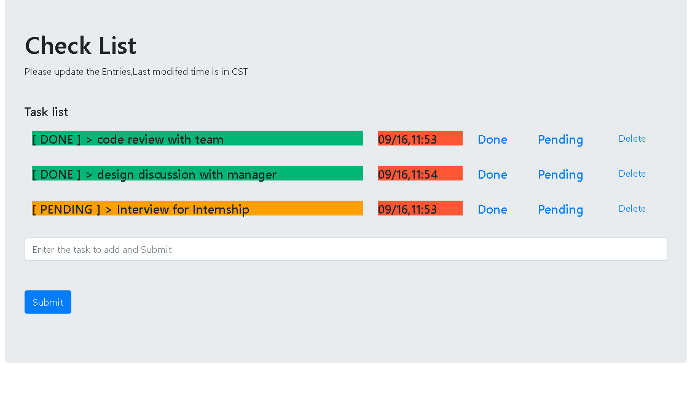

Checklist Simple Web-App




Prior to running

```
from app import app
from app import db

# Create an application context
with app.app_context():
    # Now you can safely use the database
    db.create_all()

```